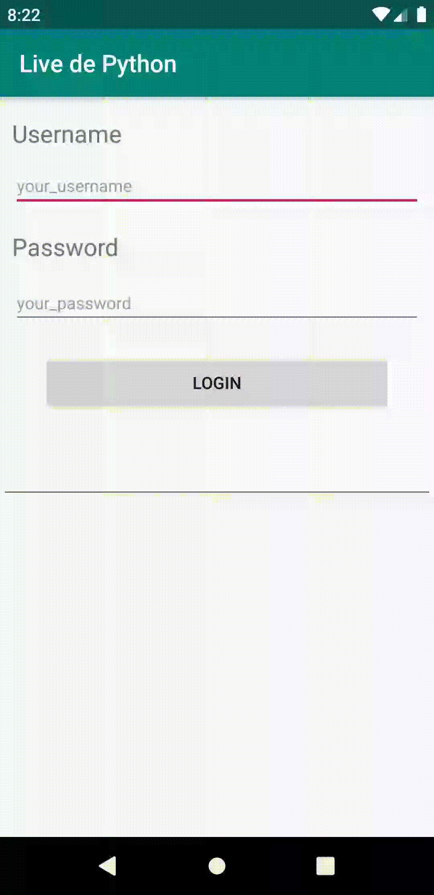

# Simple android login with beeware

This project is a simple experiment creating a login page using beeware for android

## How to use?

This project uses Poetry, so

poetry shell
poetry install

To run this project in android emulator

briefcase run android

To test and coverage

pytest --cov=livedepython

